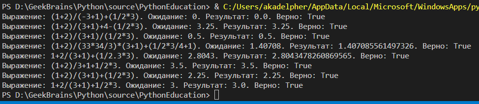

# Универсальный калькулятор с учетом скобок
## Комментарии
По сути в памяти дерево не строится. Регулярные выражения не используются. Все работает на делении строк, пока у нас не останется число доступное для парсинга. Это не очень универсально, когда у нас появятся дополнительные операции вроде sin или ^
## Дизайн решения

Рекурсивная функция calc_exp сначала убирает лишние скобки и пробелы.

Затем с конца ищет оператор "+" или "-" при этом если появляется скобка она игнорирует операторы пока скобки не закроются.

Как только оператор найден строка режется на две части и запускается рекурсия из двух функции calc_exp(left) оператор calc_exp(right).

Так же повторяется для * и /

На дне рекурсии, когда операторов не останется мы преобразовываем то, что осталось в float, а остаться у нас должно просто число

*Из минусов: Нет объектов дерева - нет универсальности*

