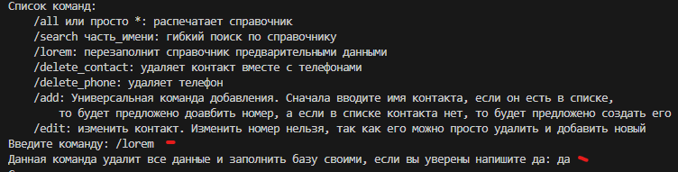
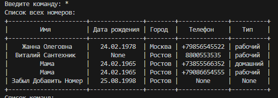
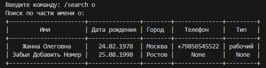
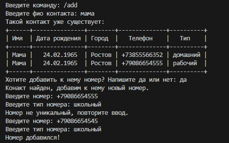

# Легкий телефонный справочник на SQL Lite

Для рисования таблиц используется библиотека prettytable
Поэтому нужно запустить:
py -m pip install PrettyTable

Так же при первом запуске можно запустить /lorem чтоб добавить немного данных

## Схема данных

У нас две таблицы, контакты в которой есть:
1. Contacts - это люди
    1. id идентфикатор
    2. name - универсальное поле для ФИО или просто названия контакта, многие конакты называют "Вадим Автомойка"
    3. birthday - не обязательное поле
    4. city - так же не обязательно
2. phone_numbers - список всех номеров
    1. id - идентификатор
    2. number - номер телефона, в приложении выполнин так чтоб быть уникальным
    3. type - тип контакта. В целом вместе номера можно указать электронную почту
    4. contact_id - ссылка на человека

## Список команд

### /lorem 
Особая команда, она полностью очщиает справочники и заполняет их изначальными данными. Её можно запустить в начале, чтоб справочник не был пустым.

### /all или * 
Основная команда - выводит справочник

### /search часть_имени
Поиск по части имени через like. Так как в python sqllite не работает поиск без учета регистра было решено добавить скрытое поле name_low_case. При этом поиск работает через оператор "Like"

### /delete_contact Удалить контакт
Полностью удаляет контакт вместе с номерами по уникальному имени

### /delete_phone:
Просто удаляет номер телефона

### /add Добавить данные
Универсальный ментод добавления данных. Сначала вы вводите имя контакта если его нет вам будет предложено добавить его. После добавления или если конакт найден вам будет предлоежено добавить и номер телефона. Но не обязательно его доавлять, возможно вы просто запомнили дату рождения контакта

# /edit Изменить данные

Изменить контакт по имени. Изменить можно только данные контакта, так как номер телефона проще просто удалить и добавить новый